# JohnsonPPTskill

根据 PPT 大纲制作**可编辑、可离线播放的单文件 HTML 演示稿**。先选择视觉风格和演讲型／阅读型，再按内容安排配图、流程、图表与文字。

通过 [`ppt-workbench`](skills/ppt-workbench/SKILL.md) 统一开始制作。不同风格独立维护主题、配图提示词和参考图，共用排版、构建、编辑与检查套件；后续可以持续添加新风格。

- **整稿风格一致**：封面、页头、正文组件、配图与尾页遵循所选风格。
- **信息密度可选**：演讲型服务现场讲解，阅读型保留独立理解所需的解释与依据。
- **阅读型可视化**：支持四种图文分区，以及流程、矩阵、表格和离线 ECharts。
- **单文件交付**：CSS、JS、Logo、图标和配图全部内嵌，支持文字编辑、另存、全屏与打印。

当前共享套件版本为 **3.1.1**。构建器输出 `.html`；明确需要 `.pptx` 时，应使用相应的 PowerPoint 制作流程，本套件不提供 HTML 转 PPTX 导出。

## 成稿示例

以下按风格展示实际页面，点击图片可查看原图。示例中的业务内容用于说明视觉与排版，不作为新项目事实。

### 素白蓝调

| 业务机制 · 白色模型与语义图标 | 总体架构 · 分层模型与直接标注 |
|:---:|:---:|
| <a href="skills/white-blue-slides/assets/reference-design/approved-open-icons.jpg">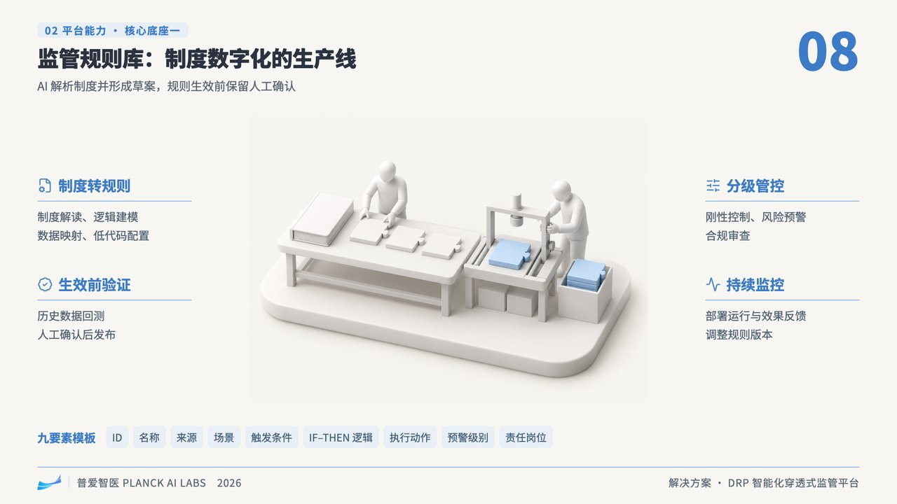</a> | <a href="skills/white-blue-slides/assets/reference-design/approved-architecture.jpg">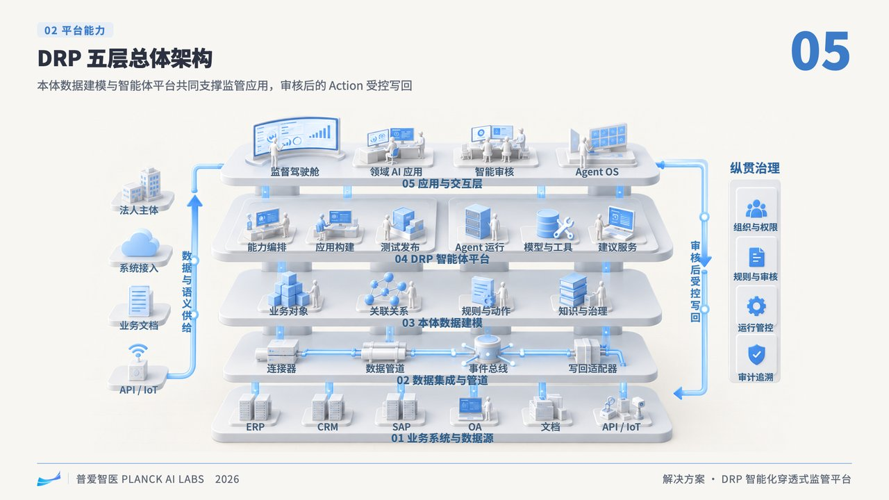</a> |

### 海蓝玻璃

以下为海蓝玻璃风格的实际页面截图，展示演讲型与四种阅读型布局。点击图片可查看 1920 × 1080 原图；图表中的数字均为排版示例数据。

| 演讲型 · 封面 | 演讲型 · 产品能力与轻量强调 |
|:---:|:---:|
| <a href="docs/images/examples/speech-cover.png">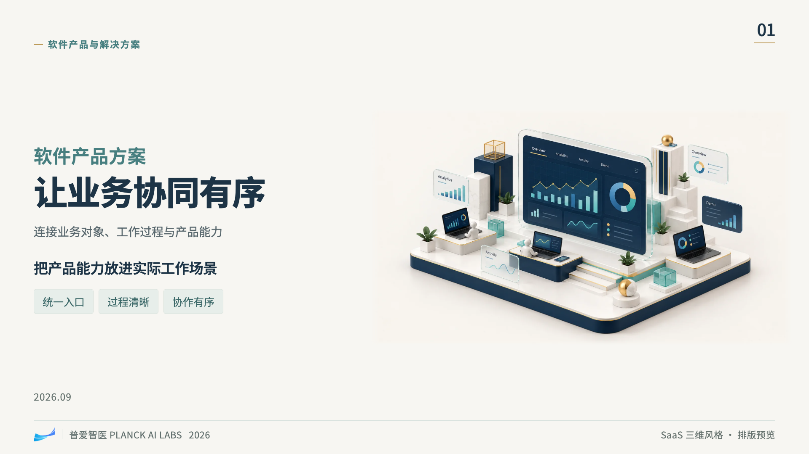</a> | <a href="docs/images/examples/speech-product.png">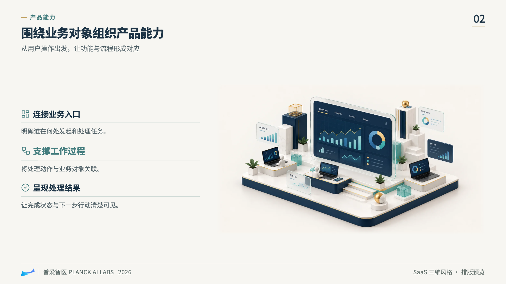</a> |

| 阅读型 · 1/2 左右 | 阅读型 · 1/2 上下 |
|:---:|:---:|
| <a href="docs/images/examples/reading-half-lr.png">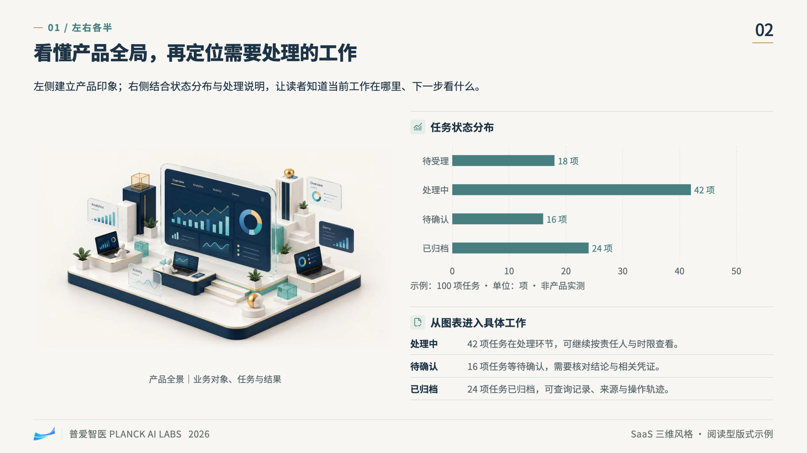</a> | <a href="docs/images/examples/reading-half-tb.png">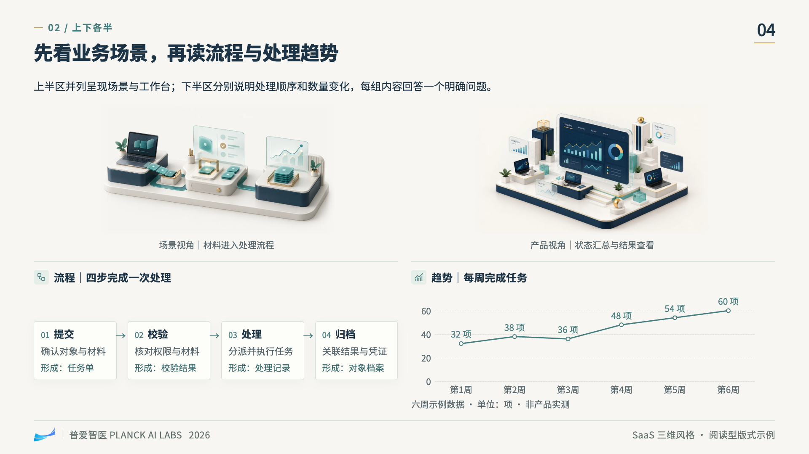</a> |

| 阅读型 · 1/2 对角双图 | 阅读型 · 1/4 配图 |
|:---:|:---:|
| <a href="docs/images/examples/reading-half-diagonal.png">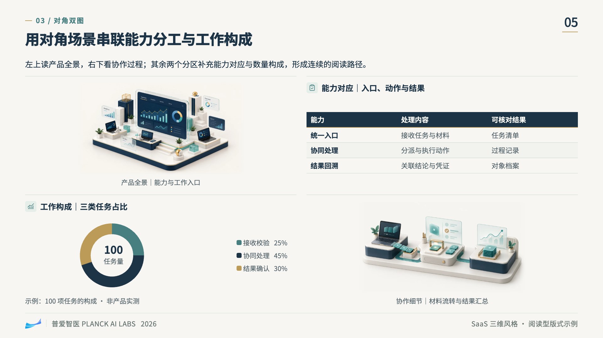</a> | <a href="docs/images/examples/reading-quarter.png">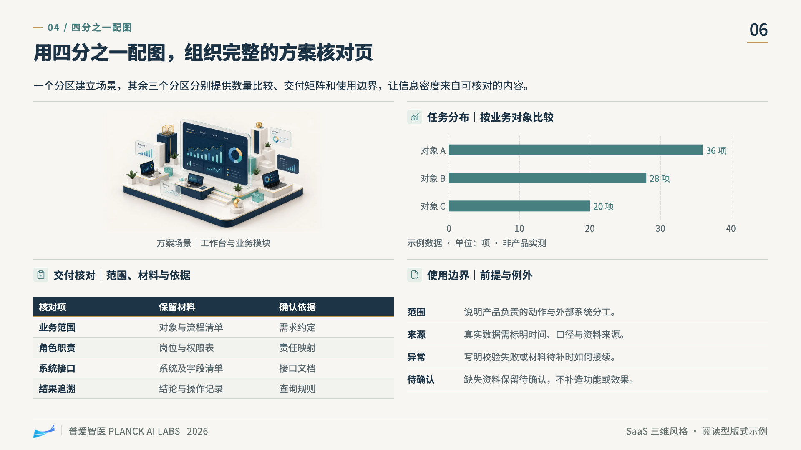</a> |

阅读型比例按主体版面分区计算，不含页头、页脚及全宽摘要。具体组织方式见下方「阅读型的四种图文分区」。

### 写实微缩

暖灰与石墨色的整页主题，配合木材、织物、矿物基座和表情细致的人物。配图默认无文字，标题和说明保留为可编辑内容。下面是用两张同风格场景验证的实际页面；图表数字仅为示例。

| 演讲型 · 团队工作系统 | 阅读型 · 对角双图与责任、任务构成 |
|:---:|:---:|
| <a href="docs/images/examples/miniature-speech-cover.png">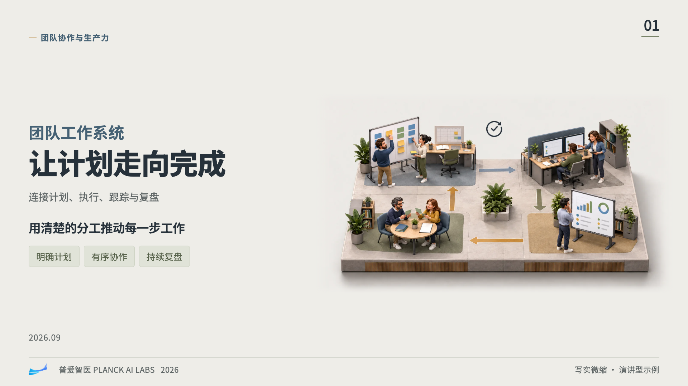</a> | <a href="docs/images/examples/miniature-reading-diagonal.png">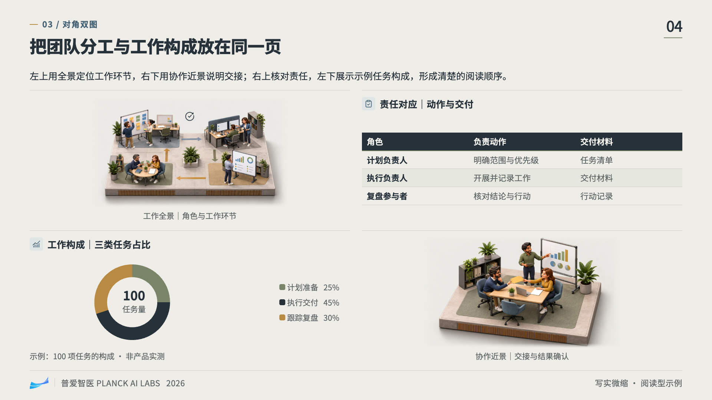</a> |

## 快速开始

### 使用 npx 安装（推荐）

电脑已安装 Node.js/npm 后，可以通过 [Skills CLI](https://github.com/vercel-labs/skills#options) 直接从本 GitHub 仓库安装，无需手动克隆或单独发布 npm 包。

**安装到 Codex：**

```bash
npx skills@latest add Johnson-Yrq/JohnsonPPTskill --skill '*' -g -a codex
```

**安装到 Claude Code：**

```bash
npx skills@latest add Johnson-Yrq/JohnsonPPTskill --skill '*' -g -a claude-code
```

- `--skill '*'`：安装仓库中的全部 Skill，目前包含 `ppt-workbench`、`white-blue-slides`、`navy-glass-slides` 和 `realistic-miniature-slides`，确保统一入口、共享套件和风格包一起安装。保留星号两侧的引号。
- `-g`：全局安装，跨项目使用；去掉该参数则安装到当前项目。
- `-a`：选择目标 Agent。

只查看仓库提供的 Skill，不执行安装：

```bash
npx skills@latest add Johnson-Yrq/JohnsonPPTskill --list
```

安装完成后，按下方「开始制作」调用 `$ppt-workbench` 即可。

### 手动安装

克隆仓库并进入目录：

```bash
git clone https://github.com/Johnson-Yrq/JohnsonPPTskill.git
cd JohnsonPPTskill
```

**Codex：**

```bash
mkdir -p ~/.codex/skills
cp -R skills/ppt-workbench skills/white-blue-slides skills/navy-glass-slides skills/realistic-miniature-slides ~/.codex/skills/
```

**Claude Code：**

```bash
mkdir -p ~/.claude/skills
cp -R skills/ppt-workbench skills/white-blue-slides skills/navy-glass-slides skills/realistic-miniature-slides ~/.claude/skills/
```

四个目录须同级放置。`white-blue-slides` 同时包含共享制作套件，其他风格依赖它；`ppt-workbench` 负责统一选择。更新已有安装时，先备份相关技能目录，再同步新版本。仅使用素白蓝调时，也可单独安装 `white-blue-slides`。

### 从旧目录名称升级

风格包统一使用直观的英文风格名称，Skill 调用名称与文件夹一致：

| 风格 | 旧目录／调用名 | 新目录／调用名 |
|---|---|---|
| 素白蓝调 | `scene-html-slides` | `white-blue-slides` |
| 海蓝玻璃 | `saas-3d-slides` | `navy-glass-slides` |
| 写实微缩 | `real-miniature-slides` | `realistic-miniature-slides` |

已安装旧版时，先将旧的三个风格目录备份到 Skill 扫描目录之外，再安装新版，并一并更新 `ppt-workbench`。不要同时保留新旧两套风格包，否则重复的风格 ID 会阻止选择。既有 `deck.json` 的 `style` 值保持不变，现有 HTML 成稿无需修改；自定义构建命令中的脚本路径需改用 `white-blue-slides/scripts/`。

### 开始制作

尚未确定风格或类型时：

> 用 $ppt-workbench，根据这份大纲制作演示稿，先让我选择风格和演讲型／阅读型。

已经明确两个选择时：

> 用 $ppt-workbench，选择海蓝玻璃风格，做成阅读型。按内容安排配图、流程、矩阵和图表，完成逐页检查。

也可以直接指定风格入口：

> 用 $white-blue-slides，把这份大纲做成素白蓝调风格的演讲型演示稿。

> 用 $navy-glass-slides，把这份方案做成海蓝玻璃风格的阅读型演示稿。

> 用 $realistic-miniature-slides，把这份团队协作方案做成写实微缩风格的阅读型演示稿，配图不要文字。

Agent 只询问缺少的选择；当前任务已经确认的风格和类型直接沿用。用户明确授权由 Agent 选择时，会按目标选择并说明。模板默认值不代表用户选择，续做项目也不会因主题变化自动换风格。

## 选择视觉风格

| 风格 | `style` | 独立入口 | 视觉特点 |
|---|---|---|---|
| **素白蓝调** | `scene-white` | [`white-blue-slides`](skills/white-blue-slides/SKILL.md) | 暖白纸底、明亮主蓝、白色哑光模型场景与微缩人物 |
| **海蓝玻璃** | `saas-3d` | [`navy-glass-slides`](skills/navy-glass-slides/SKILL.md) | 暖白纸底、海军蓝文字与重点面、灰青及少量香槟金、玻璃与精细微缩展陈 |
| **写实微缩** | `real-miniature` | [`realistic-miniature-slides`](skills/realistic-miniature-slides/SKILL.md) | 暖灰纸底、石墨与灰蓝、鼠尾草绿及少量赭黄；35–45° 微缩场景、写实 PBR 材质、表情细致的人物，配图无字 |

三种风格都支持演讲型与阅读型，可用于不同主题的大纲。配图中的对象、动作与关系由业务内容决定；风格负责视觉表达。同一份演示稿选择一种风格，整稿保持一致。

<details>
<summary>查看包内视觉参考</summary>

**素白蓝调 · 页面参考**

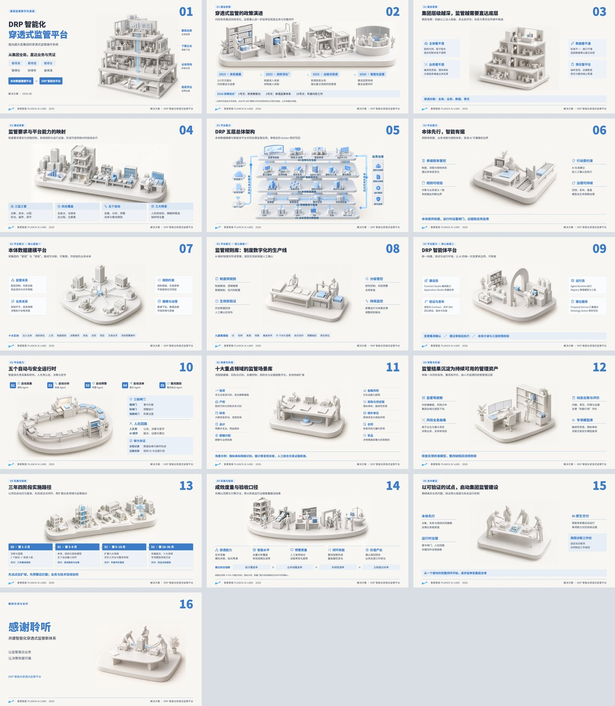

**海蓝玻璃 · 配图参考**

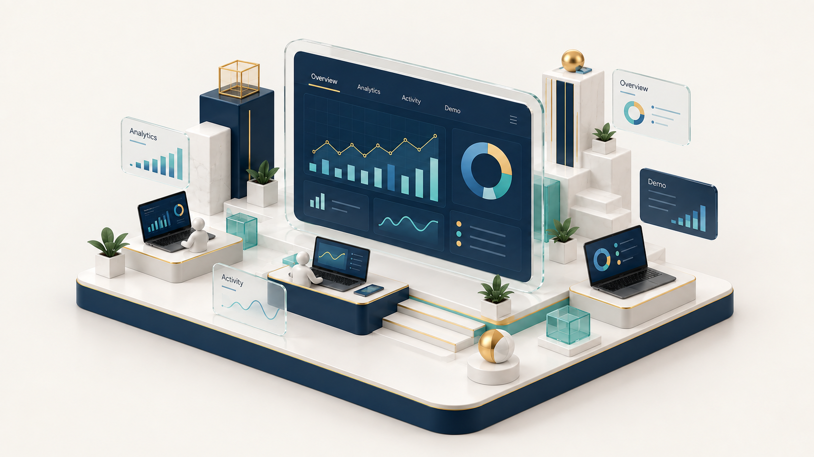

**写实微缩 · 无文字配图参考**

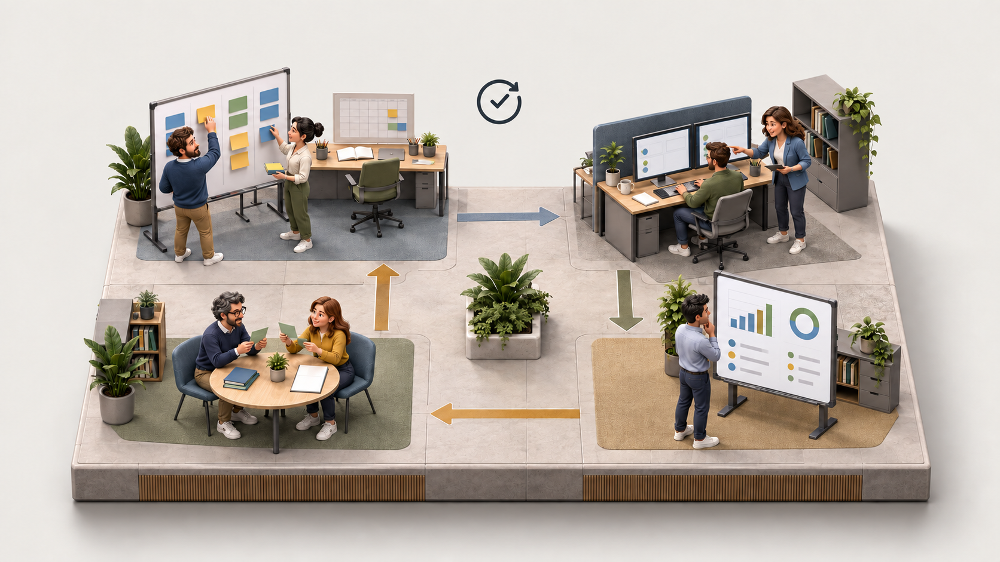

参考图用于说明材质、尺度与视觉层级，其中的业务内容不作为新项目事实。

</details>

查看当前可用风格：

```bash
python3 skills/white-blue-slides/scripts/style_packs.py --list
```

清单自动发现同级有效的风格包，返回名称、ID、说明和 Skill 入口。新包接入后会出现在清单中，无需手动修改工作台选项。

## 选择演讲型或阅读型

| 维度 | 演讲型 `speech` | 阅读型 `reading` |
|---|---|---|
| 使用方式 | 现场讲解、投屏演示 | 发给读者独立阅读 |
| 信息组织 | 一个结论和少量支撑，细节可放讲稿 | 页面保留机制、依据、条件与边界 |
| 可视化 | 主场景、关键步骤、少量标注 | 配图配合流程、矩阵、表格、图标和图表 |
| 配图分工 | 可作为页面的主要视觉 | 先安排主体版面的 1/2 或 1/4 配图分区 |
| 内容超量时 | 分页逐步讲解 | 拆成关联页面，保持可读字号和配图面积 |

阅读型的信息密度来自更多有意义的关系和证据，不靠缩小字号或堆满段落。没有可靠数值时，用流程、职责、比较和分层关系表达；不为了丰富页面而编造指标。

整稿选择记录在 `deck.json` 根对象。以下仅展示两个选择字段，完整项目另需标题与页面内容：

```json
{
  "style": "saas-3d",
  "presentation_mode": "reading"
}
```

旧稿省略字段时，仍兼容素白蓝调与演讲型。新稿应根据用户选择显式记录两个字段。详细规则见 [用途与信息密度](skills/white-blue-slides/references/presentation-modes.md)。

### 阅读型的四种图文分区

比例按**主体版面分区**计算，不含页头、页脚及全宽摘要。图表、图标和 Logo 属于内容元素，不计为配图。

| 布局 | `composition` | 配图安排 | 其余内容的组织示例 |
|---|---|---|---|
| **1/2 左右** | `half_lr` | 左半区放一张主图 | 右半区放图表＋解释，或流程＋责任矩阵 |
| **1/2 上下** | `half_tb` | 上半区放 1–3 张图 | 下半区安排两组互补内容，如流程＋趋势 |
| **1/2 对角** | `half_diagonal` | 左上、右下各一张图 | 右上、左下各一个内容模块，共两图两模块 |
| **1/4 配图** | `quarter` | 左上四分之一区域放一张图 | 其余三区放图表、表格、图标与文字，共一图三模块 |

先确定图区，再组织其余内容。多张配图各自解释不同对象、阶段或视角；主体完整，色彩与材质一致。标题和内容按分区对齐，重点项可用字号、图标与字重轻量强调。具体字段与完整页面见 [阅读型示例](skills/navy-glass-slides/assets/deck.reading.example.json)。

### ECharts 与可编辑数据

阅读型复合页支持**横向条形图、折线图和环形图**，用于类别比较、时间趋势和整体构成。图表需提供单位与来源，并在相邻文字解释判断和边界；示例数字必须标明示例性质。

播放器进入「编辑文字」后，可展开图表右下的「编辑图表数据」，修改类别、系列名和数值。图表同步刷新，「另存 HTML」后重新打开仍可继续编辑；修改数值后需核对文字结论是否仍成立。

图表库、数据与 SVG 图表均随 HTML 离线工作，无需 CDN。当前模板支持 2–8 个类别、1–3 组有限非负数；环形图仅一组且合计大于零。详细约束、字段与示例见 [图表使用说明](skills/white-blue-slides/references/charts.md)。

## 制作流程与配图

```text
确认风格与类型 → 理解大纲 → 选择版式 → 建立 deck.json
                                            ↓
                                      检查内容计划
                                            ↓
                                      准备对应配图
                                            ↓
                              构建 HTML → 逐页检查 → 交付
```

- **已有图片**：先查看并复用，按页面内容核对图片与文字的对应关系。
- **有可直接调用的内置生图工具**：按逐页简报生成、查看和调整，再构建成稿。
- **没有内置生图工具**：先导出逐页完整提示词和供图清单，收到图片后继续制作；可以分批提供。

每张缺图都需要本页独有的 `image.brief`，描述对象与数量、动作或系统处理、关系机制、层级细节与构图。导出器会检查缺项和跨页重复的简报。页面标题、真实数据、业务说明和架构标注留在可编辑内容中。

素白蓝调与写实微缩配图默认无字；写实微缩只提供 `ui_text: "none"`，包括白板、屏幕、文件、日历和键帽都不生成文字。海蓝玻璃默认为 `ui_text: "demo"`，只允许软件屏幕内的 Overview、Analytics、Activity、Demo 四个示意标签，也可选择 `none`。配图内的示意图表不充当真实业务数据。

最终交付物为一个独立 `.html` 文件；`deck.json`、提示词、图片清单和 QA 截图用于制作与续改。缺图的 `--draft` 版本仅用于内部预排。

## 项目与运行命令

以下命令在仓库根目录执行，`project/` 表示本次演示稿的工作目录。

```text
project/
├── 大纲.md
├── deck.json
├── images/                  # 本项目配图
├── 演示稿.html              # 最终交付
└── qa/                      # 截图与检查报告
```

可从完整示例建立项目并替换为自己的内容：

| 示例 | 内容 |
|---|---|
| [素白蓝调示例](skills/white-blue-slides/assets/deck.example.json) | 封面、场景信息页和尾页 |
| [海蓝玻璃演讲型示例](skills/navy-glass-slides/assets/deck.example.json) | 低密度产品介绍与轻量强调 |
| [海蓝玻璃阅读型示例](skills/navy-glass-slides/assets/deck.reading.example.json) | 四类图文分区、流程、矩阵与图表 |
| [写实微缩演讲型示例](skills/realistic-miniature-slides/assets/deck.example.json) | 团队工作系统、协作交接与轻量强调 |
| [写实微缩阅读型示例](skills/realistic-miniature-slides/assets/deck.reading.example.json) | 四类图文分区、职责流程与示例任务图表 |

示例附带配图简报；正式构建前，需要按清单准备对应图片。项目图片路径相对 `deck.json` 所在目录，完整数据格式见 [内容数据与构建](skills/white-blue-slides/references/deck-format.md)。

```bash
# 1. 检查设计决策和页面结构，不要求图片已经存在
python3 skills/white-blue-slides/scripts/build_deck.py project/deck.json \
  --check-plan --out project/design-plan.json

# 2. 导出提示词与供图清单，不调用模型或网络
python3 skills/white-blue-slides/scripts/prepare_images.py project/deck.json \
  --out project/image-handoff

# 3. 图片齐全后，构建单文件 HTML
python3 skills/white-blue-slides/scripts/build_deck.py project/deck.json \
  --out project/演示稿.html

# 4. 渲染审查并保存逐页截图
node skills/white-blue-slides/scripts/audit_deck.cjs project/演示稿.html \
  --out project/qa --browser chrome
```

| 可选工具或参数 | 用途 |
|---|---|
| `match_paper.py project/images/*.png --paper '#F7F6F2'` | 校准配图底色并备份原图；纸色取自所选主题 |
| `--embed-format keep` | 保留原始图片格式；默认优先转 WebP 内嵌 |
| `--embed-quality 85` | 设置图片压缩质量 |
| `--builder` | 加载项目新增版式；复用共享组件 |
| `--allow-restyle` | 用户明确要求超出所选主题，自定义封面或页头页脚时使用 |

选择现有命名风格无需 `--allow-restyle`。自动检查覆盖结构、图文分区、可见组件和播放器功能；逐页视觉检查还需核对配图主体、图文对应和独立阅读时的完整性。

### 13 种共享版式

| 版式 | 用途 | 版式 | 用途 |
|---|---|---|---|
| `cover` | 封面 | `architecture` | 分层架构与直接标注 |
| `scene` | 大场景与两侧说明 | `flow` | 步骤与控制点 |
| `split` / `triad` | 左右说明／三段控制 | `domains` | 多领域清单 |
| `journey` | 阶段、比较或路径 | `formula` | 公式与因素关系 |
| `table` | 表格与边界对照 | `relations` | 实体与关联 |
| `closing` | 有配图的收束尾页 | `reading` | 四类阅读型复合信息页 |

## 播放、编辑与保存

工具栏提供：**总览 · 全屏 · 讲稿 · 编辑文字 · 另存 HTML · 打印**。默认画布为 1920 × 1080，并按窗口等比适配。文字编辑后需「另存 HTML」保留修改，浏览器内的修改不会自动回写 `deck.json`。

| 按键 | 作用 | 按键 | 作用 |
|---|---|---|---|
| `→` / `PageDown` / `空格` | 下一页 | `O` | 总览 |
| `←` / `PageUp` | 上一页 | `F` | 全屏 |
| `Home` / `End` | 首页／末页 | `N` | 讲稿面板 |
| `Esc` | 退出总览、编辑或讲稿 | URL `#3` | 直接打开第 3 页 |

## 持续添加新风格

每个风格包维护独立的页面主题、配图基底、参考素材和验收规范。共享脚本负责布局与功能，不随风格复制。

新包按视觉特点使用小写英文与短横线命名，统一以 `-slides` 结尾；目录名与 Skill 名一致，中文显示名称用于工作台选择。

```text
skills/
├── ppt-workbench/           # 统一选择入口
├── white-blue-slides/       # 素白蓝调 + 共享制作套件
│   ├── scripts/            # 构建、配图清单、自动发现与检查
│   ├── assets/             # 基础组件、播放器、阅读布局与图表
│   └── references/         # 数据、类型、图表与接入规范
├── navy-glass-slides/          # 海蓝玻璃独立风格包
├── realistic-miniature-slides/   # 写实微缩独立风格包
└── new-style-slides/        # 未来新增的同级包
    ├── SKILL.md
    ├── agents/openai.yaml
    ├── assets/
    │   ├── style.json
    │   ├── theme.css
    │   ├── image-style.txt
    │   └── reference-design/
    └── references/
        ├── design-system.md
        ├── image-workflow.md
        └── quality-check.md
```

新增包在 `assets/style.json` 声明 `schema: "html-slide-style/v1"`、唯一 ID、风格资源和检查契约。新方向完成样例确认与验证后设为 `ready`，再同级安装；工作台、构建器和配图导出器自动识别。所有新风格继续复用演讲型／阅读型和四种阅读布局。

```bash
# 开发时连同 draft 包一起检查；不会使草稿变成可用风格
python3 skills/white-blue-slides/scripts/style_packs.py --list --include-drafts
```

完整字段、接入步骤和验证要求见 [新增独立风格包](skills/white-blue-slides/references/adding-styles.md)。

## 依赖与开发检查

| 用途 | 依赖 |
|---|---|
| 构建 HTML、导出提示词、列出风格 | Python 3.9+ 标准库 |
| 可选 WebP 压缩 | Pillow；缺少时保留原图格式 |
| 配图底色校准 | NumPy + Pillow |
| 自动浏览器审查 | Node.js + Playwright + Chrome/Chromium |
| 可选总览拼图 | Sharp |

ECharts 5.6.0 已随套件内置，无需额外安装或访问 CDN。生图能力由当前 Agent 环境提供，安装 Skill 不等于安装生图工具。无法运行自动审查时，使用可用浏览器逐页检查并说明验证范围。

修改脚本或资源后运行自测：

```bash
python3 skills/white-blue-slides/scripts/selftest.py
```

自测覆盖共享组件、两种类型、风格独立性、动态新增风格、图表输入与缺图恢复。主题或版式发生变化时，再使用真实配图构建并逐页检查；自测不替代视觉验收。

## 许可证与素材

项目代码采用 [MIT](LICENSE)。第三方组件保留各自许可证：

- Lucide 图标：[MIT 许可证](skills/white-blue-slides/assets/lucide-LICENSE.txt)。
- Apache ECharts：[Apache 2.0 许可证](skills/white-blue-slides/assets/vendor/ECHARTS-LICENSE.txt) 与 [NOTICE](skills/white-blue-slides/assets/vendor/ECHARTS-NOTICE.txt)，同时内嵌于含图表的成稿。

内置 Logo 与默认页脚为普爱智医品牌资源；用于其他品牌项目时，应替换为对应资源。包内参考图用于说明视觉风格，示例业务内容与数字不构成实际产品能力或效果声明。
